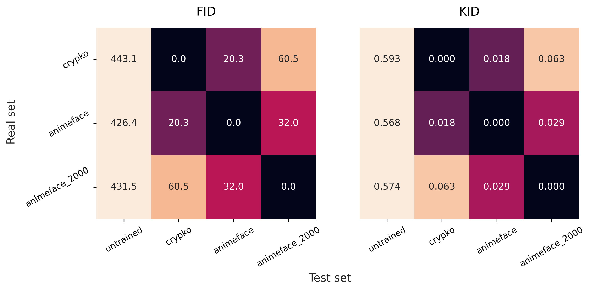
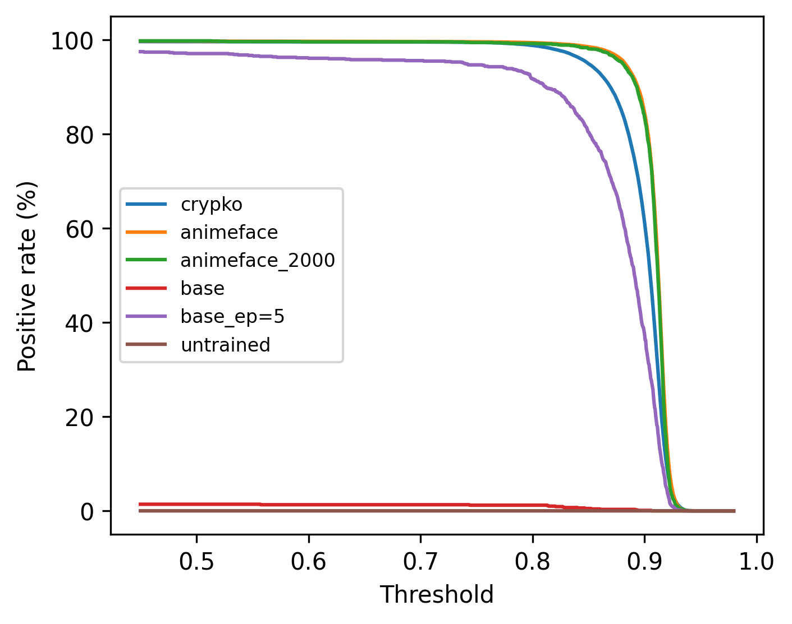

## Setup

### Addtional Dataset
In addtion to the `Crypko` originally provided by this task, [`Anime Face Dataset`](https://github.com/bchao1/Anime-Face-Dataset), 2000 samples are taken out from `Anime Face Dataset` and resized to `64x64` to create a `valid set` for future needs.

The dataset are organized as follow:

| Name             | n_samples | `path`                | comments |
|------------------|-----------|-----------------------|----------|
| `crypko`         | 71314     | `./data/faces`        | |
| `animeface`      | 61565     | `./data/images`       | |
| `animeface_2000` | 2000      | `./data/validate_set` | all samples resized to 64x64 |

### Evaluation of model performance

The orignal evaluation methods are not publicly available, therefore the following benchmarks are used instead.

#### FID/KID

FID(Fréchet Inception Distance) and KID(Kernel Inception Distance) are metrics evaluating similarity of real and generated data. The FID metric is based on the assumption that the features computed by a pre-trained Inception network, for both real and generated images, have a Gaussian distribution. We can then use known metrics for Gaussians as our distance metric.[^1] However, comparing two generators with different saple size is unreliable due to bias from the Gaussian assumption and that there may be an effect that depends on the generator.[^2] The KID aims to improve on FID by relaxing the Gaussian assumption. KID measures the squared Maximum Mean Discrepancy (MMD) between the Inception representations of the real and generated samples using a polynomial kernel. This is a non-parametric test so it does not have the strict Gaussian assumption, only assuming that the kernel is a good similarity measure.[^1]

As there is no definate conclusion of which metric gives the best result and neither is this thew focus point of this experiment, both FID and KID are evaluated with [clean-fid](https://github.com/GaParmar/clean-fid), which provides ready-to-use FID and KID calculations. Worthnotingly, this is not the implementation of the [orignial paper for FID](https://arxiv.org/abs/1706.08500), but a improved version to minimize bias from sample resizing and JPEG image compression.

[^1]: [A study on the evaluation of generative models](https://arxiv.org/abs/2206.10935)
[^2]: [Effectively Unbiased FID and Inception Score and where to find them](https://arxiv.org/abs/1911.07023)

#### Amine Face Dectection

Amine Face Dectection is based on [yolov5](https://github.com/ultralytics/yolov5) and the finetuned weights by [yolov5_anime](https://github.com/zymk9/yolov5_anime). A simple script is used to detect the faces in generated samples, and the ratio of faces detected is used as a second benchmark.

#### Baseline Performance of Metrics

To understand the effectiveness of the metrics, both metrics are validated with samples generate by untrained GAN model and cross-validated between real samples by `matrics_baseline.sh`

**FID/KID**

**Amine Face Dectection**

| Entry            | positive (thres=0.5) | positive (thres=0.895) | positive (thres=0.9) |
|------------------|----------------------|------------------------|----------------------|
| `untrained`      | 0.0 %                | 0.0 %                  | 0.0 %                |
| `crypko`         | 99.6 %               | 69.6 %                 | 61.3 %               |
| `animeface`      | 99.7 %               | 89.4 %                 | 84.5 %               |
| `animeface_2000` | 99.8 %               | 88.2 %                 | 83.5 %               |
